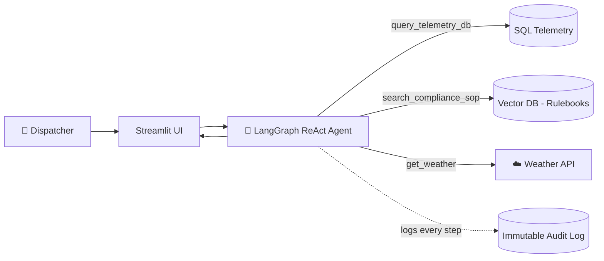

<div align="center">

# ❄️ Cold Chain Logistics – AI Dispatch Console

### An autonomous AI assistant that spots cargo-spoilage risks *before* they happen


</div>

---

## 📖 Overview

This project transforms a legacy cold-chain logistics database into an **autonomous AI dispatch console**. A **LangGraph ReAct agent** combines spatial SQL telemetry, live weather APIs and **Vector RAG** compliance rulebooks to proactively anticipate and resolve cargo-spoilage risks.

Built for enterprise reliability, it ships with an **invisible, immutable SQL audit trail** and is deployed to a live **AWS EC2** environment through automated **CI/CD** pipelines.

---

## 🚀 Key Features

| | Feature | Description |
|---|---|---|
| 🧠 | **Autonomous ReAct Agent** | A LangGraph orchestrator that decides on its own when to call tools, query the database or read RAG documents. |
| 🔗 | **Structured + Unstructured Fusion** | Bridges SQL telemetry (structured) with compliance rulebooks via Vector RAG (unstructured) in one continuous workflow. |
| 🗺️ | **Geospatial NLP Translation** | The LLM converts natural-language locations into precise GPS bounding-box SQL queries. |
| 🔒 | **Immutable Audit Trail** | Every LLM thought, tool call and decision is permanently logged to SQL for compliance and trust. |
| 🚢 | **Automated CI/CD** | GitHub Actions deploys every push to `main` straight to AWS EC2. |
| 💬 | **Streamlit Dispatch UI** | A clean chat interface for dispatchers to interact with the agent. |

---

## 🏗️ Architecture



**Example flow**

> *"Is Shipment A42 on track?"*
> → agent calls `query_telemetry_db` → then `search_compliance_sop` → replies with the current temperature vs. the allowed limit (**-22°C to -18°C**).

---

## 🧰 Tech Stack

- **AI Framework:** LangGraph, ReAct agent architecture, Vector RAG
- **Databases:** MySQL (spatial / GPS bounding queries), Vector DB for rulebooks
- **External APIs:** Live weather API
- **Frontend:** Streamlit
- **Infrastructure:** AWS EC2
- **DevOps:** GitHub Actions, CI/CD, immutable SQL logging

---

## ⚙️ Prerequisites

- Python **3.9+**
- **MySQL** (spatial data types enabled)
- AWS CLI configured with EC2 access
- API keys for your LLM provider, Weather API and Vector DB

---

## 🛠️ Local Installation

**1. Clone the repository**
```bash
git clone https://github.com/your-organization/cold-chain-ai-assistant.git
cd cold-chain-ai-assistant
```

**2. Create a virtual environment**
```bash
python -m venv venv
source venv/bin/activate      # Windows: venv\Scripts\activate
```

**3. Install dependencies**
```bash
pip install -r requirements.txt
```

**4. Configure environment variables** – create a `.env` file in the project root:
```env
LLM_API_KEY=your_api_key_here
WEATHER_API_KEY=your_weather_api_key
DB_CONNECTION_STRING=your_database_connection_string
VECTOR_DB_URL=your_vector_db_url
```

**5. Run the app**
```bash
streamlit run main.py
```

---

## 🌐 Deployment (CI/CD)

Every push to `main` triggers the GitHub Actions pipeline:

1. ✅ Lint and test the Python codebase
2. 🔐 Authenticate with AWS using GitHub Secrets
3. 📥 Pull the latest code onto the AWS EC2 instance
4. 🔄 Restart the LangGraph agent service

> **Note:** Store your AWS credentials under **Settings → Secrets and variables → Actions** in your GitHub repository.

---

## 🔒 Audit & Compliance Logging

The **invisible SQL audit trail** needs no manual setup. The system intercepts all LangGraph events — tool calls, API responses, RAG retrieval context and step-by-step reasoning — and writes them to an **immutable SQL table**, giving full traceability for regulatory compliance in cold-chain handling.

---

## 📂 Project Structure

```text
cold-chain-ai-assistant/
├── main.py                 # App entry point
├── agent/                  # LangGraph ReAct agent & tools
├── db/                     # SQL queries, spatial helpers, audit logger
├── rag/                    # Vector store & compliance rulebooks
├── .github/workflows/      # CI/CD pipeline
├── requirements.txt
└── README.md
```

> Adjust folder names to match your actual repository.

---

## 🤝 Contributing

Contributions, issues and feature requests are welcome. Fork the repo, create a feature branch and open a pull request.

## 📜 License

Distributed under the MIT License. See `LICENSE` for details.

---

<div align="center">

⭐ If you found this project useful, please give it a star!

</div>
